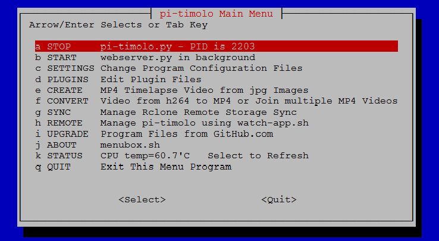
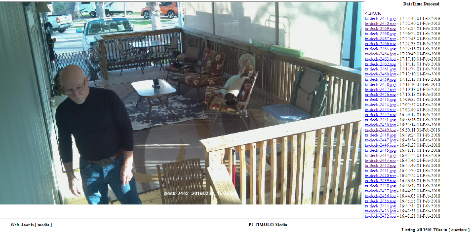

# pi-timolo
### Raspberry (Pi) - (Ti)melapse, (Mo)tion, (Lo)wlight
### Wiki https://github.com/pageauc/pi-timolo/wiki     
YouTube Videos https://www.youtube.com/playlist?list=PLLXJw_uJtQLa11A4qjVpn2D2T0pgfaSG0
  
### Quick Install
For Easy pi-timolo-install.sh onto raspbian RPI. 

    curl -L https://raw.github.com/pageauc/pi-timolo/master/source/pi-timolo-install.sh | bash

From a computer logged into the RPI via SSH(Putty) or desktop terminal session  
* Use mouse to highlight curl command above, right click, copy.  
* Select RPI SSH(Putty) window, mouse right click, paste.   
The command will download and execute the GitHub pi-timolo-install.sh script   

**IMPORTANT** - A raspbian apt-get update and upgrade will be performed as part of install
so it may take some time if these are not up-to-date       
    
### or Manual Install   
From logged in RPI SSH session or console terminal perform the following. You can review
the pi-timolo-install.sh script code before executing.

    cd ~
    wget https://raw.github.com/pageauc/pi-timolo/master/source/pi-timolo-install.sh
    chmod +x pi-timolo-install.sh
    ./pi-timolo-install.sh
    
### Run pi-timolo 
Default is motion only see config.py for detailed settings   
    
    cd pi-timolo
    ./pi-timolo.py

see Github Wiki for More Details https://github.com/pageauc/pi-timolo/wiki        

### Description
pi-timolo is a python picamara module application for a Raspberry PI computer.
A RPI camera module must be attached. It can take timelapse and motion detection
images separately or together. Takes Long exposure Night (lowlight) images for
Time Lapse and/or Motion. Has smooth twilight transitions based on a threshold light
setting, so a real time clock is not required. Customization settings are saved in a config.py and conf files.
The application is primarily designed for headless operation and includes sync.sh that
can securely synchronize files with a users google drive.  This works well for remote security
cameras. Camera settings can also be administered remotely sync.sh
 
### Menubox
The lastest version of pi-timolo has a whiptail admin menu system. The menu's allow
start/stop of pi-timolo.py and webserver.py as background tasks, as well as
editing configuration files, making timelapse videos from jpg images, converting or joining mp4 files Etc.    
To run from ssh console or terminal session.

    cd ~/pi-timolo
    ./menubox.sh

 
### Webserver
I have also written a standalone LAN based webserver.py to allow easy access to pi-timolo image and video files
on the Raspberry from another LAN computer web browser.  There is no setup required but the display
settings can be customized via variables in the config.py file or via menubox admin menuing.   
To run from ssh console or terminal session.
    
    cd ~/pi-timolo
    ./webserver.py

 
### Reference Links  
Detailed pi-timolo Wiki https://github.com/pageauc/pi-timolo/wiki  
YouTube Videos https://www.youtube.com/playlist?list=PLLXJw_uJtQLa11A4qjVpn2D2T0pgfaSG0
 
Good Luck
Claude Pageau 
